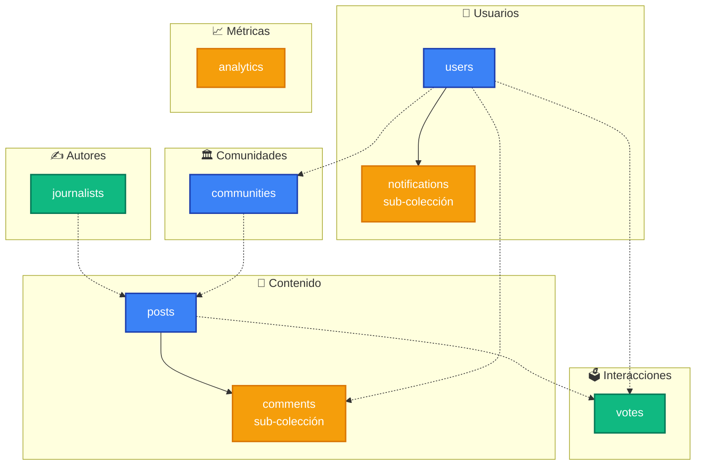
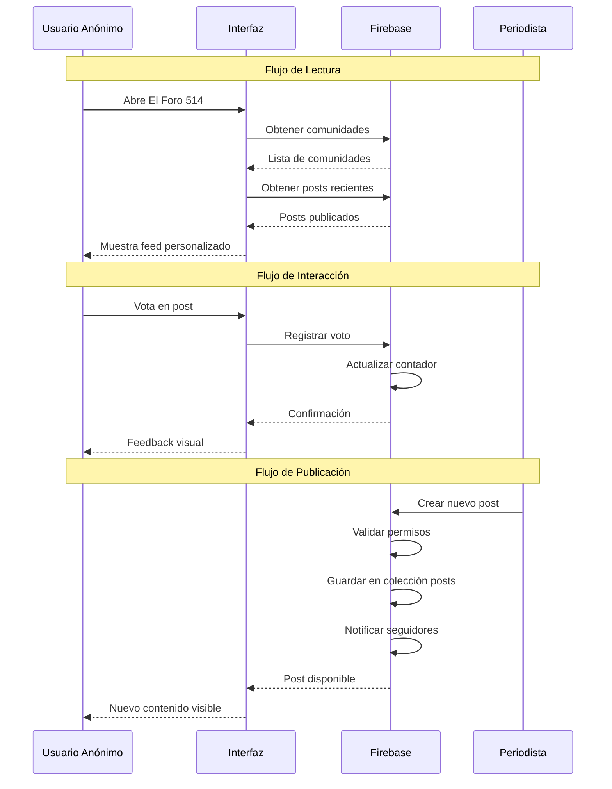

# 📊 Diagrama de Estructura de Base de Datos - El Foro 514

## 🗺️ Mapa Visual de Colecciones



## 🔄 Flujo de Datos Principal



## 📋 Esquema de Datos Detallado

### 1. **Colección `users`**

```json
{
  "userId": {
    "username": "string (generado)",
    "avatarColor": "string (hex color)",
    "isAnonymous": "boolean (siempre true)",
    "followedCommunities": ["array de IDs"],
    "joinDate": "timestamp",
    "preferences": {
      "theme": "light|dark",
      "notifications": "boolean"
    },
    "stats": {
      "totalVotes": "number",
      "totalComments": "number"
    }
  }
}
```

### 2. **Colección `communities`**

```json
{
  "communityId": {
    "name": "string",
    "description": "string",
    "members": "number",
    "followers": ["array de userIds"],
    "moderators": ["array de userIds"],
    "isActive": "boolean",
    "icon": "string (emoji)",
    "color": "string (hex)",
    "rules": ["array de strings"],
    "stats": {
      "totalPosts": "number",
      "totalComments": "number"
    }
  }
}
```

### 3. **Colección `posts`**

```json
{
  "postId": {
    "title": "string",
    "content": "string (HTML permitido)",
    "author": "string",
    "authorRole": "string",
    "authorId": "string (ref a journalists)",
    "communityId": "string (ref a communities)",
    "createdAt": "timestamp",
    "publishedAt": "timestamp",
    "votes": "number",
    "upvotes": ["array de userIds"],
    "downvotes": ["array de userIds"],
    "tags": ["array de strings"],
    "isPublished": "boolean",
    "engagement": {
      "views": "number",
      "shares": "number",
      "commentsCount": "number"
    }
  }
}
```

### 4. **Sub-colección `posts/{postId}/comments`**

```json
{
  "commentId": {
    "content": "string",
    "authorId": "string (ref a users)",
    "createdAt": "timestamp",
    "votes": "number",
    "parentId": "string|null",
    "level": "number (0-2)",
    "replies": ["array de commentIds"]
  }
}
```

## 🔍 Consultas Principales

### **Feed Principal**

```javascript
// Obtener posts recientes de comunidades seguidas
db.collection("posts")
  .where("communityId", "in", followedCommunities)
  .where("isPublished", "==", true)
  .orderBy("createdAt", "desc")
  .limit(10);
```

### **Posts Más Votados**

```javascript
// Top posts por votos
db.collection("posts")
  .where("isPublished", "==", true)
  .orderBy("votes", "desc")
  .limit(5);
```

### **Búsqueda de Posts**

```javascript
// Búsqueda por tags (requiere índice)
db.collection("posts")
  .where("tags", "array-contains-any", searchTerms)
  .where("isPublished", "==", true)
  .orderBy("createdAt", "desc");
```

### **Comentarios de Post**

```javascript
// Comentarios principales (nivel 0)
db.collection("posts")
  .doc(postId)
  .collection("comments")
  .where("level", "==", 0)
  .orderBy("createdAt", "desc");
```

## 🎯 Optimizaciones de Rendimiento

### **Índices Compuestos Requeridos:**

1. `posts`: `[communityId, isPublished, createdAt]`
2. `posts`: `[tags, isPublished, votes]`
3. `comments`: `[postId, level, createdAt]`
4. `votes`: `[targetId, targetType, userId]`

### **Estrategias de Cache:**

- **Posts recientes**: Cache en memoria por 5 minutos
- **Comunidades**: Cache en localStorage por 1 hora
- **Contadores**: Actualización en lotes cada 30 segundos
- **Comentarios**: Paginación con cursor-based pagination

### **Límites de Documento:**

- **Posts**: Máximo 1MB (contenido + metadata)
- **Comentarios**: Máximo 100 por batch
- **Usuarios**: Máximo 1000 comunidades seguidas
- **Analytics**: Agregación diaria en documentos separados

## 🔐 Seguridad y Validación

### **Reglas de Validación:**

```javascript
// Validar estructura de post
function validatePost(post) {
  return post.title.length <= 200 &&
         post.content.length <= 10000 &&
         post.tags.length <= 10 &&
         isValidCommunityId(post.communityId);
}

// Validar permisos de escritura
function canWritePost(userId) {
  return exists(/databases/$(database)/documents/journalists/$(userId)) &&
         get(/databases/$(database)/documents/journalists/$(userId)).data.canPublish == true;
}
```

### **Rate Limiting:**

- **Votos**: Máximo 100 por usuario por hora
- **Comentarios**: Máximo 50 por usuario por día
- **Búsquedas**: Máximo 200 por usuario por hora

Esta estructura está diseñada para soportar:

- ✅ **Miles de usuarios simultáneos**
- ✅ **Cientos de posts diarios**
- ✅ **Miles de comentarios por día**
- ✅ **Búsquedas en tiempo real**
- ✅ **Analytics detallados**
- ✅ **Escalabilidad horizontal**
